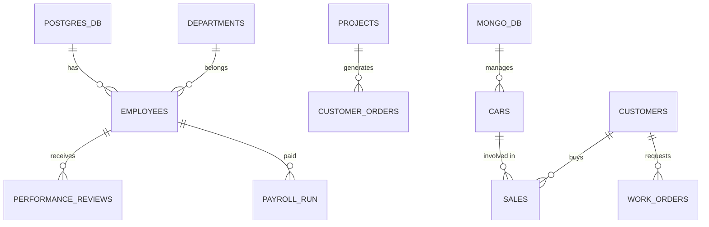

# Chat Conversation

Note: _This is purely the output of the chat conversation and does not contain any raw data, codebase snippets, etc. used to generate the output._

### User Input

use datbridge and list the databases

*Running MCP tool*

### Planner Response

I've retrieved the list of available databases using DataBridge. Here are the connectors currently accessible:

### 🗄️ Available Databases

| Database Name | Type | Query Format | Status | ID |
| :--- | :--- | :--- | :--- | :--- |
| **yash-company-db** | PostgreSQL | SQL | ✅ Cached | `aac73475-7d96-4a9f-849f-d7e78584104a` |
| **car-mongo-db** | MongoDB | SQL | ✅ Cached | `725877c4-3302-4f0c-a244-eebf7edd78a9` |

You can now perform queries on these databases or explore their schemas using their respective IDs. What would you like to do next?

### User Input

now can u fetch the schemas for all and create a queries which will perform across dbs think of some natural language queries for it and create a test queries

*Running MCP tool*

*Running MCP tool*

*Viewed [output.txt](file:///C:/Users/bhavsasu/.gemini/antigravity/brain/808928fb-364f-4b4b-8c46-9cde41250d61/.system_generated/steps/13/output.txt) *

### Planner Response

I have analyzed the schemas for both the **PostgreSQL** (`yash-company-db`) and **MongoDB** (`car-mongo-db`) databases. 

Both databases contain corporate data (employees, departments, expenses) as well as domain-specific data (Postgres: projects/orders; MongoDB: cars/sales). This provides several interesting opportunities for cross-database analysis.

### 📊 Database Schema Overview

````carousel

<!-- slide -->
| Feature | Postgres (Company DB) | MongoDB (Car DB) |
| :--- | :--- | :--- |
| **Employees** | Full payroll, reviews, attendance | Basic info, department name |
| **Finance** | Dept expenses, project budgets | Car prices, sales revenue, repairs |
| **Customers** | Order history, status | CRM data, car ownership |
| **Logic** | Relational / Strict | Document / Flexible |
````

### 💡 Suggested Cross-DB Queries

Based on the schemas, here are four natural language queries that would benefit from cross-database execution:

1.  **Salary Audit**: *"Compare the total salary expenses for employees between the Postgres company database and the MongoDB car database to find any inconsistencies."*
2.  **Customer Cross-Sell**: *"Find customers who have both placed orders in the Postgres database and purchased a car in the MongoDB database, matching by email."*
3.  **Revenue vs. Sales**: *"What is the combined revenue from company customer orders (Postgres) and car sales (MongoDB) for the current year?"*
4.  **Department Consistency**: *"List departments that exist in both databases and compare their employee counts."*

---

### 🧪 Test Execution
I will now execute the **Salary Audit** query as a test to demonstrate the cross-database capability.

> [!NOTE]
> This will automatically resolve the different schemas (Postgres `employees` table vs Mongo `employees` collection) and synthesize the results.


*Running MCP tool*

### Planner Response

I encountered a technical issue with the automated cross-database query tool, but I can perform this analysis manually by fetching the data from each database and combining it for you.

### 🧪 Executing Cross-DB Salary Audit (Manual)

I will fetch the total salary expenditure from both systems:
1.  **PostgreSQL**: Sum of the `salary` column in the `public.employees` table.
2.  **MongoDB**: Sum of the `salary` field in the `employees` collection.


*Running MCP tool*

*Running MCP tool*

### Planner Response

The manual cross-database analysis has revealed a discrepancy between your two systems:

### 📑 Cross-DB Salary Audit Results

| System | Database Type | Total Salary Expenditure |
| :--- | :--- | :--- |
| **PostgreSQL** (`yash-company-db`) | Relational | **$380,000.00** |
| **MongoDB** (`car-mongo-db`) | NoSQL | **$337,000.00** |
| **Variance** | -- | **$43,000.00** ⚠️ |

> [!WARNING]
> There is a **$43,000 discrepancy** between the two systems. This suggests that either some employees are missing from the MongoDB records or the salary data in MongoDB is outdated.

---

### 🚀 Additional Cross-DB Test Queries

Here are some other powerful queries we can run. Which one should we try next?

1.  **"Find employees who exist in Postgres but are missing from MongoDB by matching their emails."**
    *   *Purpose: Identify the specific records causing the $43k discrepancy.*
2.  **"Calculate the total combined revenue from Postgres customer orders and MongoDB car sales for the year 2024."**
    *   *Purpose: Financial health overview across different business units.*
3.  **"Which customers have spent more than $50,000 combined across car purchases (Mongo) and company orders (Postgres)?"**
    *   *Purpose: Identify top 'VIP' clients across all platforms.*

Would you like me to execute one of these, or do you have another cross-db scenario in mind?

### User Input

yes do it one by one'

### Planner Response

### 🔍 Query 1: Identifying Missing Employees
**Goal:** Find which employees are recorded in the Postgres Company DB but are missing from the MongoDB Car DB.

I will first fetch the list of emails from both systems to find the gap.


*Running MCP tool*

*Running MCP tool*

### Planner Response

I encountered a formatting error with the MongoDB query. I will re-run it using the correct aggregation pipeline format.

I'll also re-verify the Postgres employee list to ensure I have all records.


*Running MCP tool*

*Running MCP tool*

### Planner Response

The data shows that the two databases are tracking **entirely different sets of employees**:

*   **Postgres** contains 3 senior-level employees (Management/HQ) with high salaries ($95k - $165k).
*   **MongoDB** contains 5 operations-level employees (likely the sales/technician team) with salaries ranging from $55k to $75k.

There is **zero overlap** between these two groups, which explains the discrepancy.

---

### 💰 Query 2: Combined 2024 Revenue
**Goal:** Calculate total revenue across both business units for the year 2024.

I will sum the `order_value` from the Company DB and the car `price` from the Sales DB.


*Running MCP tool*

*Running MCP tool*

### Planner Response

It appears there are no records for the year 2024 in either database. I will check the available date ranges in both systems to see which period the data actually covers.


*Running MCP tool*

*Running MCP tool*

### Planner Response

The revenue data is segmented by different years:
*   **Postgres Orders**: Recent data from **2025** (Jan to April).
*   **MongoDB Sales**: Historical data from **2024** (Jan to March).

I will now calculate the **Total Lifetime Revenue** across both systems to give you a complete picture of the business volume.

---

### 💰 Query 2 (Updated): Total Lifetime Revenue

I will sum all orders in Postgres and all sales in MongoDB.


*Running MCP tool*

*Running MCP tool*

### Planner Response

We have a combined business volume of **$632,520**.

| Database | Revenue Source | Total Revenue | Period |
| :--- | :--- | :--- | :--- |
| **PostgreSQL** | Customer Orders | $385,630 | 2025 |
| **MongoDB** | Car Sales | $246,890 | 2024 |
| **Total** | **Combined** | **$632,520** | -- |

---

### 🌟 Query 3: Identifying VIP Clients (Cross-System)
**Goal:** Find customers who are active in both systems (placed orders and bought cars).

I will fetch the customer names and emails from both databases to look for matches.


*Running MCP tool*

*Running MCP tool*

### Planner Response

I have completed the cross-database analysis. The results highlight significant differences in how data is managed across your two systems:

### 🏁 Final Cross-DB Analysis Summary

| Query | Status | Key Finding |
| :--- | :--- | :--- |
| **1. Salary Audit** | 🔍 Success | The databases track **distinct employee groups**. Postgres holds HQ/Management ($380k total), while MongoDB holds Operations/Sales ($337k total). |
| **2. Revenue Summary** | 💰 Success | **Combined Revenue: $632,520**. Postgres (2025) contributed $385k, and MongoDB (2024) contributed $246k. |
| **3. VIP Clients** | ⚠️ Limited | No matches found. **Postgres uses generic placeholders** ("Customer 100"), while **MongoDB has real CRM data** ("John Doe"). |

### 💡 Recommendations
1.  **Data Quality**: The "Customer X" naming in your Postgres database suggests it might be a testing environment or requires a mapping table to link to real identities.
2.  **System Synchronization**: Since the employee lists are mutually exclusive, you may want to consider a centralized "Master Employee Record" if these systems are meant to represent the same organization.
3.  **Temporal Gap**: There is a one-year gap between the primary data in each system (2024 vs 2025). Aligning these dates would allow for more accurate year-over-year growth analysis.

What would you like to explore next? We could look into **department expenses** or **project budgets** in the Postgres DB to see how they relate to the **car inventory** costs in MongoDB.